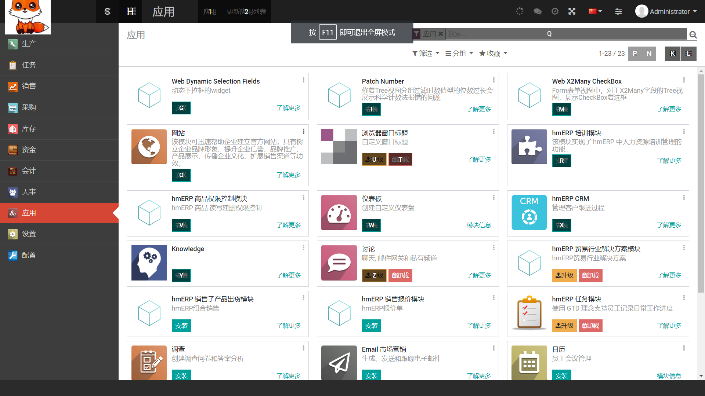
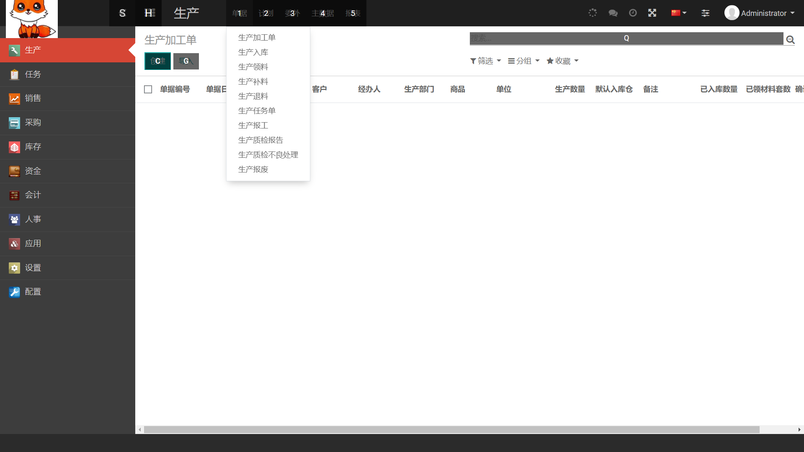

**一、已经商业化应用的的项目， 因为mes系统的设备在内网，只能发demo数据网址 ：** 

请在电脑浏览器下打开体验网址

demo  网址 http://47.240.54.105:8081

后端  http://47.240.54.105:8088 

 admin/123456

验证码 ，为了方便随便输入即可

**二、目前MES系统的功能 ：** 

1、 产品和原材料双向溯源 （支持二维码扫描输入后的自动解析），

2、工艺流程定义，

3、生产计划， 

4、工作过程监控，

5、工作进度监控，

6、设备管理，

7、班组管理，

8、质量管理、

9、现场数据采集（PLC设备，网口/串口通讯，二维码扫描等），

10、可视化展示（订单编号，生产线，班组，计划产量，实际产量，次品数量，合格率，完工率，设备状态和稼动率，工艺工序，现场视频 ，等）

11、系统管理（用户管理，菜单，基础数据，日志），

12、报表和数据导入导出。

13、本MES系统设计的时候，已经考虑到兼容多条产品线 

14、 后端和ERP的对接 ：

你可能需要对接erp的地方主要有：
物料，产品，BOM，订单，设备，班组人员，

http://erp.dreammm.net

数据库  选择 hm-erp，
  ，  email(账户) 填 demo ， 密码 demo

 需要erp，crm的企业可以推荐用上，世界500强企业丰田都在用的这款erp。
 中国著名IT企业浪潮集团也是基于这款ERP开发的 ，浪潮在研发和销售基于同款ERP软件。

当然，客户在实施MES的时候 可以选择和erp对接， 也可以使用独立的MES数据 
下面是 erp的截图  

三、部分截图

看板

后端

四、 源码地址 

1  本项目是看板部分源码 ，前端代码 参考  https://gitee.com/imdreamer/hm-MES.git

2   后端代码 参考 ：https://gitee.com/wangziyangyang/MES-Springboot.git

3   物联网组件用户对接设备  参考  ：https://gitee.com/iteaj/iot.git

五、 项目技术架构

前端   echarts， html，juery 

后端技术 :springBoot, netty，mybatis+，mysql ,redis,rabbitmq, mqtt,
udp, tcp,http, mqtt, websocket, modbus,plc，欧姆龙，西门子,
时序数据库tdEngine

五、 相关技术资料链接

前端

日期工具库：static/lib/dayjs.min.js

Javascript 工具库：static/lib/lodash.min.js

Layui 树形表格插件

https://gitee.com/whvse/treetable-lay

图标库使用

http://www.fontawesome.com.cn/faicons

echart

https://www.echartsjs.com/zh/api.html#echarts

六、  技术支持

 欢迎 star 和 fork

手机/微信 18665802636 ，QQ 75039960

七、qq群 298734429 

qq群二维码 

