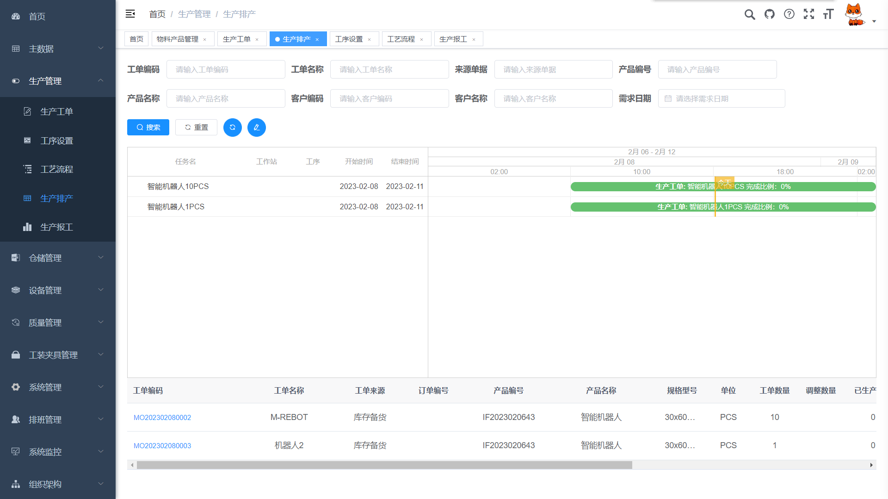

** 范围说明 ：** 

mes系统可以独立设计， 也可以和其它系统对接 ，mes系统的边界很界定，可能跟ERP，wms，plm 等系统有交互，

MOM概念的提出正是基于mes这个尴尬的问题 。

**一、已经投入实际生产应用的的项目， 这里我发的是demo数据网址 ：** 

请在电脑浏览器(推荐使用chrome)下打开体验网址

demo  网址 http://47.240.54.105:8081

后端  http://47.240.54.105:8088 

 admin/123456   ,验证码 ，为了方便随便输入即可比如888。

提示：
win11下面，后端启动后需要等一段时间（时间不确定，有时间比较快几秒钟，有时间比较慢可能是30分钟，原因未知）， 浏览器下的界面才能显示出来。

在win10，windows server 2016，linux下面 ，没有这个问题，都是立即显示界面的 。

**二、目前MES系统的功能 ：** 

1、 产品和原材料双向溯源 （支持二维码扫描输入后的自动解析，设备自动上传产品数据），

2、工艺流程定义，

3、生产计划， 

4、工作过程监控，

5、工作进度监控，

6、设备管理，

7、班组管理，

8、质量管理（质量检测使用了产品参数自动测量技术，包括图像自动识别技术）、

9、报工 （包含在产品管理模块中，自动报工）

10、现场数据采集（PLC设备，网口/串口通讯，二维码扫描等），

11、可视化展示（订单编号，生产线，班组，计划产量，实际产量，次品数量，合格率，完工率，设备状态和稼动率，工艺工序，现场视频 ，等）

12、系统管理（用户管理，菜单，基础数据，日志），

13、报表和数据导入导出。

14、兼容多条产品线 

15、 后端和ERP的对接 ：

如果你是高级应用，可以对接hm-erp，
你可能需要对接erp的地方主要有：
仓库，物料，产品，BOM，订单，设备，班组人员，客户和供应商

http://erp.dreammm.net
（该ERP 也包含 MES 功能）

数据库  选择 hm-erp ，
  ，  email(账户) 填 demo ， 密码 demo

 需要erp，crm，mes的企业可以推荐用上，世界500强企业丰田都在用的这款erp。
 中国著名IT企业浪潮集团也是基于这款ERP开发的 ，浪潮在研发和销售基于同款ERP软件。

当然，客户在实施MES的时候 可以选择和erp对接， 也可以使用独立的MES数据 
下面是 erp的截图  

**三、部分截图**

看板

后端

**四、 源码地址 **

1     前端代码 参考 mes-front,,  用nginx 部署，doc目录下面有样本

2   后端代码 参考 ：mes-backend  

      需要替换 mysql 配置， redis  配置，  

      rabbitmq url 配置是在controller文件代码中配置的，或者在数据库表里面配置
      是选择项，不一定配置， 

     前端的url 也是 在controller 文件中配置的 ，这个必须配置正确。

      在 controller 配置的两个url  ，高版本的，可以通过“数据采集配置” 界面进行配置 ，或者在数据库表里面配置 。

        后端API 的swagger展示界面地址 ：
       http://localhost:8044/swagger-ui.html

3   物联网组件用户对接设备  参考  ：iot-componet

     这个如果没有设备，不实际采集数据就不用启动它，启动的入口项目是test 。
     

**五、 项目技术架构**

前端    html+js+css，jquery ,echarts，等

后端技术 :springBoot, shiro，netty，mybatis plus，mysql ,redis,rabbitmq。

丰富的物联网组件，用于数据采集：

udp, tcp,http, mqtt, rabbitmq，websocket, modbus,plc，欧姆龙Fins，西门子 PLC,
时序数据库tdEngine，mysql，redis
启动入口是iot-test ，
在物联网组件项目下面有一份 readme.md

建议 ：数据采集后请使用 mq 组件传递到 mes 或者其它物联网后端应用，能够更好的解耦。
Netty 可以启动多线程 处理多个端口的数据采集 。

==============

**六、 相关技术资料链接**

在doc目录下面有一份说明文档《开源MES和开源ERP说明书.pdf》

以及《简易mes部署说明.docx》

=====简易MES 前端技术资料 ：=====

日期工具库：static/lib/dayjs.min.js

Javascript 工具库：static/lib/lodash.min.js

Layui 树形表格插件

https://gitee.com/whvse/treetable-lay

图标库使用

http://www.fontawesome.com.cn/faicons

echart

https://www.echartsjs.com/zh/api.html#echarts

**七、  技术支持**

 分享高质量的源码不容易，欢迎 star 和 fork，

手机/微信 18665802636 ，QQ 75039960

八、qq交流群 298734429 

qq群二维码 

**九、  其他版本MES介绍 

================================
**另外一套MES演示链接 ***

后端是java  ，采用开源 ruoyi-vue-pro框架
 ，
http://47.242.184.27:8071/

==========**c#版本的MES系统 ***==========

前后分离 ，后端 net core ， 前端VUE，
了解详情请加qq。

系统亮点：
低代码设计平台，括自定义打印设计，Excel 模版导出，自定义桌面工作台，部分表单融入进度条步骤条，移动端设计精美合理，多平台支持，计精美看板，自定义实体扩展，表格拖拉拽，工序拖拽，数据字典支持SQL配置等诸多亮点。

==低代码看板设计器====

低代码-大屏幕看板设计平台-使用讲解

https://www.bilibili.com/video/BV1gs4y1978N/?vd_source=1db635fc04060deb7c4dfe378341bb4a

